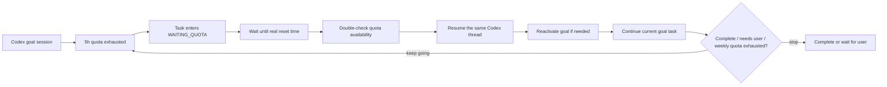

<p align="center">
  <a href="./README.en.md">English</a> |
  <a href="./README.md">中文</a>
</p>

# Codex Auto Runner

> When the Codex 5-hour quota window recovers, automatically resume the active goal task that was already in progress, preserve the original thread context, and keep moving until the weekly quota is exhausted, the task is complete, or human judgment is required.

Codex Auto Runner is a local recovery runner for Codex goal sessions. It is built for a very specific moment: a long Codex task is still clear, the thread context is still valuable, the goal is still active, but the 5-hour quota window has been exhausted.

It does not bypass limits. It prevents recovered quota from sitting idle.

Set a goal in Codex once. Codex Auto Runner detects the current session, checks whether goal mode is enabled, records the task state, waits for quota recovery, verifies that quota is actually available, then resumes the same Codex thread and reactivates the in-progress goal if needed.

In practice, it turns Codex's 5-hour recovery windows into an automatic relay: quota returns, the task continues; quota is exhausted, the runner waits; quota returns again, the original goal moves forward again. The cycle continues until the weekly quota has been fully used, the task is complete, or the system reaches a point that needs a person.

Codex Auto Runner is an unofficial local companion for Codex. It is not an OpenAI product and does not modify, bypass, or expand account limits. It simply helps you use the quota you already have with less idle time and more continuity.

## Vision

Codex is powerful because it can hold context, follow a goal, and reason across many steps. The costly part of quota exhaustion is not waiting. The costly part is when the next window opens and nobody is there to continue the work.

Codex Auto Runner gives long-running Codex work a cross-window continuation loop:

1. Codex is working on an active goal.
2. The 5-hour quota window is exhausted.
3. The local daemon records the thread, goal, and task state.
4. At the recovery time, the runner reads the real quota state again instead of blindly starting.
5. If quota is confirmed available, the original Codex thread is resumed.
6. If the goal was paused or limited by quota pressure, it is restored to active.
7. The runner sends the smallest necessary continuation instruction:

```text
Continue and start the current active goal task
```

8. Codex reads the original context and keeps going.
9. The cycle repeats until the weekly quota is exhausted, the task completes, or human input is required.

The core promise is simple: no blank new session, no lost context, no silent recovery window.

## Use Cases

- Large code migrations, cross-module refactors, and difficult bug investigations.
- Product features that require multiple Codex turns to implement properly.
- Overnight or unattended work where quota may recover while you are away.
- Goal-mode sessions where the intended direction is already clear.
- Treating the 5-hour and weekly quota windows as schedulable resources instead of manual timers.

## Capabilities

- **5-hour quota recovery monitoring**: reads the real Codex quota buckets and schedules wakeups from the real reset time.
- **Weekly quota drive mode**: keeps a task moving across multiple 5-hour recoveries until the weekly quota is exhausted.
- **Goal-mode detection**: discovers Codex sessions and identifies which ones have goal mode enabled; sessions without a goal cannot create automatic tasks.
- **Active-goal restoration**: restores paused, limited, or quota-stopped goals back to active before continuing.
- **Same-thread resume**: resumes the original Codex thread so the model can continue from the existing context.
- **Reset-credit continuation**: when enabled by the user, can continue after weekly exhaustion if reset credits are available.
- **Auto and Pro task creation**: Auto mode attaches to a Codex goal session; Pro mode exposes priority, sandbox, approval, and validation settings.
- **Quota overview**: shows the 5-hour and 1-week windows, remaining quota, refresh time, and task state.
- **Local web UI**: Vite + React interface with Chinese and English language switching.
- **Local daemon**: scheduler, HTTP API, SQLite state, and task queue all run on the user's machine.

## Runtime Loop



The scheduler does not run just because a timestamp arrived. At the recovery point, it reads quota again and performs a jittered second verification. It only starts the task when quota has moved from exhausted to available or near limit.

## Project Structure

```text
codex-auto-runner/
  apps/
    daemon/               local daemon, quota watcher, scheduler, HTTP API
    web/                  Vite + React frontend
    cli/                  car command-line tool
  packages/
    app-server-client/    Codex app-server JSON-RPC client
    codex-resolver/       discovers and stages the Codex executable
    quota-engine/         quota bucket parsing and recovery-time logic
    persistence/          SQLite tasks, events, locks, and state machine
    task-engine/          thread resume/start, goal activation, turn lifecycle
    validator/            validation command runner
    git-guard/            repository safety checks before task execution
    logger/               structured logging and sensitive-field redaction
    shared-types/         shared configuration and domain types
  schemas/
    generated/            Codex app-server protocol schemas
  tools/
    protocol-probe/       account and quota protocol probe
    thread-turn-probe/    thread and turn protocol probe
```

## Requirements

- Windows with Codex Desktop.
- Node.js 20 or newer.
- pnpm 9 or newer.
- A Codex account with available quota.

The current implementation is focused on Windows Codex Desktop. Other platforms can be added later, but Windows is the main verified target.

## Quick Start

```bash
pnpm install
pnpm doctor
pnpm --filter @car/daemon start
pnpm web
```

Open the local frontend:

```text
http://127.0.0.1:5173/
```

`pnpm doctor` automatically finds Codex on the current machine and verifies that the executable can run. It does not write real local paths into the repository and does not read or upload account credentials.

### Codex Discovery Order

Users do not need to edit the code to bind their own Codex path. At runtime, Codex Auto Runner resolves Codex in this order:

1. `CAR_CODEX_EXEC`: an explicit executable path provided by the user.
2. `%LOCALAPPDATA%\CodexAutoRunner\codex-portable\codex.exe`: an already staged local copy.
3. `codex` from `PATH`.
4. Windows Codex Desktop: discovered through `Get-AppxPackage -Name OpenAI.Codex`, then copied into `%LOCALAPPDATA%\CodexAutoRunner\codex-portable\`.

The GitHub repository does not store a real `%USERPROFILE%` path or bind to the author's Codex installation. Each user resolves Codex locally on first run.

## Useful Commands

```bash
pnpm car status
pnpm car quota
pnpm car task list
pnpm car task run-now <task-id>
pnpm car task pause <task-id>
pnpm car task resume <task-id>
pnpm schema:gen
pnpm probe
pnpm probe:turn
pnpm doctor
pnpm privacy:check
pnpm typecheck
pnpm test
```

## Safety Boundaries

- The daemon listens only on `127.0.0.1`.
- The local HTTP API uses a generated token.
- `.env`, logs, databases, build output, probe dumps, and local runtime data are ignored by Git.
- `api.json`, `car-api.token`, `runner.db`, `status.json`, and `events.jsonl` are generated only on the user's machine and excluded by `.gitignore`.
- Codex executable paths are resolved only at runtime; logs and diagnostics redact `%LOCALAPPDATA%`, `%USERPROFILE%`, and similar local path prefixes.
- Logs redact token, authorization, secret, and account identifier fields.
- The runner does not automatically push, deploy, or accept high-risk approvals for the user.
- Codex network access must be explicitly enabled and is off by default.
- If quota is unknown, login is required, the project is locked, validation fails, or the task needs human judgment, automatic execution stops.

Before publishing changes, run:

```bash
pnpm privacy:check
```

This command scans repository files and fails if it finds real user paths, Codex private session paths, common API keys, GitHub tokens, Bearer tokens, or tracked local runtime files.

## Development Checks

```bash
pnpm --filter @car/web build
pnpm --filter @car/daemon typecheck
pnpm test
```

## Current Status

The core local loop is implemented:

- Codex app-server connection and quota reading.
- 5-hour and 1-week quota bucket parsing.
- Quota recovery scheduling with second verification.
- Codex session discovery and goal-mode detection.
- Same-thread resume and active-goal restoration.
- Auto task creation and Pro task configuration.
- Local quota dashboard with Chinese and English UI.
- Reset-credit continuation option after weekly exhaustion.

Codex Auto Runner has one clear goal: when Codex is ready to continue, the task should not still be waiting for someone to return and press the button.
