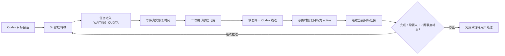

# Codex Auto Runner

> 当 Codex 的 5h 限额恢复时，自动开启正在进行中的目标任务；在不浪费任何一个恢复窗口的前提下，持续推进，直至任务完成、需要人工介入，或周额度被充分消耗。

Codex Auto Runner 是一个运行在本地的 Codex 目标任务恢复器。它为一个非常具体、也非常真实的痛点而生：长任务跑到一半，5h 额度耗尽；上下文还在，目标还在，任务还没结束，但下一次额度恢复时，人不一定守在电脑前。

它要解决的不是“如何绕过限制”，而是“如何不浪费已经恢复的额度”。

你只需要在 Codex 里设定好目标。Codex Auto Runner 会识别当前会话、检测目标模式、记录任务状态、等待额度恢复、二次确认额度确实可用，然后恢复同一个 Codex 线程，重新激活正在进行的目标，让 Codex 继续沿着原上下文往前推进。

换句话说，它把 Codex 的 5h 恢复窗口变成了一次次自动接力：额度恢复，任务继续；再次耗尽，再次等待；直到周额度被用到极致，或者目标真正抵达终点。

这是一个非官方的本地工具，不属于 OpenAI 官方产品，也不会突破、规避或修改任何额度规则。它只是让你已经拥有的额度更有秩序、更少空转、更接近连续生产力。

## 核心愿景

Codex 的强大之处在于上下文、目标和持续推理。真正昂贵的不是等待本身，而是等待之后没人接住任务。

Codex Auto Runner 让长任务拥有“跨额度窗口继续推进”的能力：

1. Codex 正在执行一个目标任务。
2. 5h 额度耗尽，任务进入等待。
3. 本地守护进程记录当前线程、目标和任务状态。
4. 到达恢复时间后，系统重新读取真实额度，而不是盲目启动。
5. 额度确认可用后，恢复原 Codex 线程。
6. 如果目标因为额度限制暂停，自动恢复为 active。
7. 向 Codex 发送最小必要继续指令：

```text
继续，并开启当前正在进行的目标任务
```

8. Codex 读取原上下文继续推进。
9. 循环往复，直到周额度耗尽、任务完成，或遇到需要用户判断的情况。

这就是它的中心承诺：不新开空会话，不丢失上下文，不让恢复后的 5h 窗口沉默过去。

## 适合什么场景

- 大型代码迁移、跨模块重构、复杂 Bug 排查。
- 需要 Codex 连续多轮推进的产品功能实现。
- 晚上、工作间隙、离开电脑后仍希望任务在额度恢复时自动继续。
- 目标模式已经设置清楚，希望 Codex 按原目标持续执行。
- 希望把 5h 窗口和周额度当成可调度资源，而不是手动盯守的倒计时。

## 主要能力

- **5h 限额恢复监测**：读取 Codex 真实额度桶，按真实 reset 时间安排唤醒。
- **周额度持续推进**：支持“直到周额度耗尽”模式，让任务跨多个 5h 窗口继续运行。
- **目标模式识别**：自动发现 Codex 会话，识别哪些会话已开启目标模式；未设置目标的会话无法创建自动任务。
- **自动恢复 active 目标**：目标因暂停、受限或额度耗尽停住时，可在恢复运行前重新设为 active。
- **原线程续跑**：恢复同一个 Codex thread，让模型读取原上下文继续，而不是新开一个空会话。
- **充值/重置额度续跑**：用户开启后，可在周额度耗尽且有可用重置次数时继续任务。
- **自动版 + 专业版**：自动版面向一键接管目标会话；专业版保留优先级、沙箱、审批、验证命令等高级配置。
- **额度概览**：展示 5h 与 1 周窗口、剩余额度、刷新时间、任务状态。
- **本地 Web UI**：Vite + React 前端，提供中英文切换与接近 Codex 风格的界面。
- **本地守护进程**：调度器、HTTP API、SQLite 状态、任务队列都运行在本机。

## 运行闭环



调度器不会只因为时间到了就贸然执行。它会在恢复点重新读取额度，并经过抖动后的二次验证，确认额度确实从 exhausted 变为 available 或 near_limit 后才启动任务。

## 项目结构

```text
codex-auto-runner/
  apps/
    daemon/               本地守护进程、额度监测、调度器、HTTP API
    web/                  Vite + React 前端
    cli/                  car 命令行工具
  packages/
    app-server-client/    Codex app-server JSON-RPC 客户端
    codex-resolver/       自动探测并暂存 Codex 可执行文件
    quota-engine/         额度桶解析、阻塞判定、恢复时间计算
    persistence/          SQLite 任务、事件、锁与状态机
    task-engine/          thread resume/start、目标激活、turn 生命周期
    validator/            验证命令执行器
    git-guard/            任务运行前的仓库安全检查
    logger/               结构化日志与敏感字段脱敏
    shared-types/         共享配置与领域类型
  schemas/
    generated/            Codex app-server 协议 schema
  tools/
    protocol-probe/       账号与额度协议探针
    thread-turn-probe/    线程与回合协议探针
```

## 环境要求

- Windows + Codex Desktop。
- Node.js 20 或更高版本。
- pnpm 9 或更高版本。
- 可用的 Codex 账号额度。

当前实现优先面向 Windows Codex Desktop 环境。其他平台后续可以扩展，但不是当前主要验证目标。

## 快速开始

```bash
pnpm install
pnpm --filter @car/daemon start
pnpm web
```

打开本地前端：

```text
http://127.0.0.1:5173/
```

## 常用命令

```bash
pnpm car status
pnpm car quota
pnpm car task list
pnpm car task run-now <task-id>
pnpm car task pause <task-id>
pnpm car task resume <task-id>
pnpm schema:gen
pnpm probe
pnpm probe:turn
pnpm typecheck
pnpm test
```

## 安全边界

- daemon 只监听 `127.0.0.1`。
- 本地 HTTP API 使用随机 token 鉴权。
- `.env`、日志、数据库、构建产物、探针转储、本机运行数据不会进入 Git。
- 日志会脱敏 token、authorization、secret、account_id 等字段。
- 不自动 push、不自动部署、不替用户接受高风险审批。
- Codex 网络访问需要显式开启，默认关闭。
- 当额度未知、需要登录、项目被锁定、验证失败或任务需要人工判断时，调度器会停止自动推进。

## 开发检查

```bash
pnpm --filter @car/web build
pnpm --filter @car/daemon typecheck
pnpm test
```

## 当前状态

项目已经具备核心闭环：

- Codex app-server 连接与额度读取。
- 5h 与 1 周额度桶解析。
- 额度恢复点调度与二次验证。
- Codex 会话发现与目标模式检测。
- 原线程续跑与目标 active 恢复。
- 自动版任务创建与专业版任务配置。
- 本地额度仪表盘与中英文界面。
- 周额度耗尽后的重置次数续跑选项。

Codex Auto Runner 的目标很明确：当 Codex 可以继续时，任务不应该还在等待人回来按下按钮。
